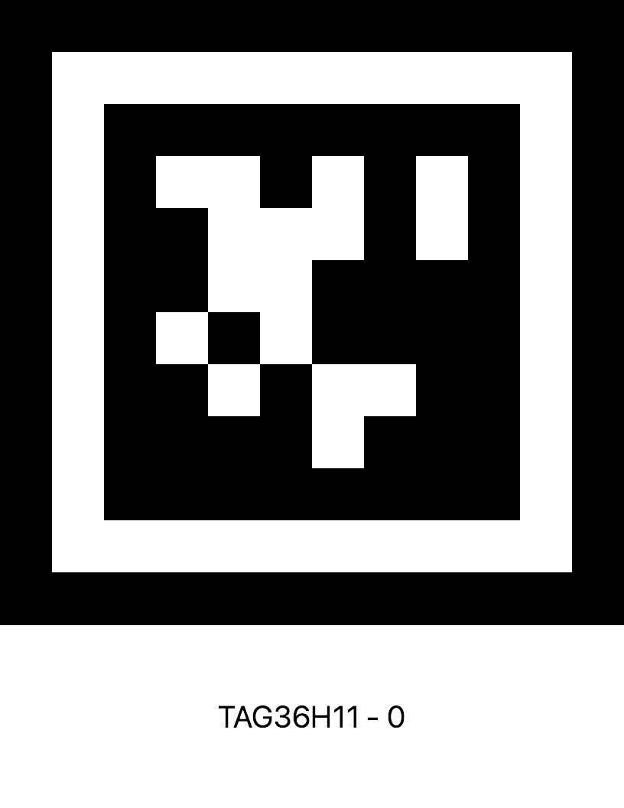
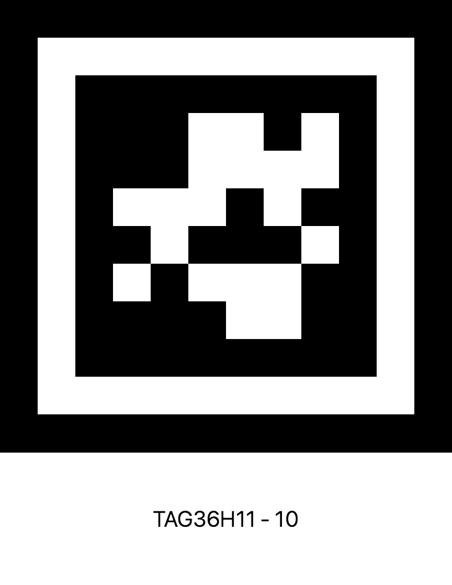
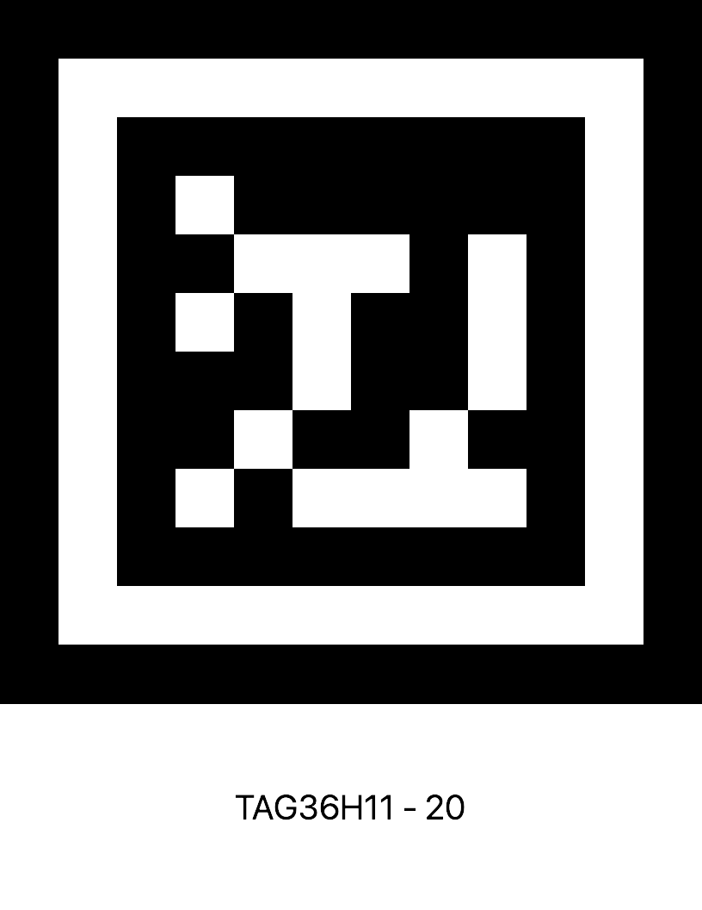
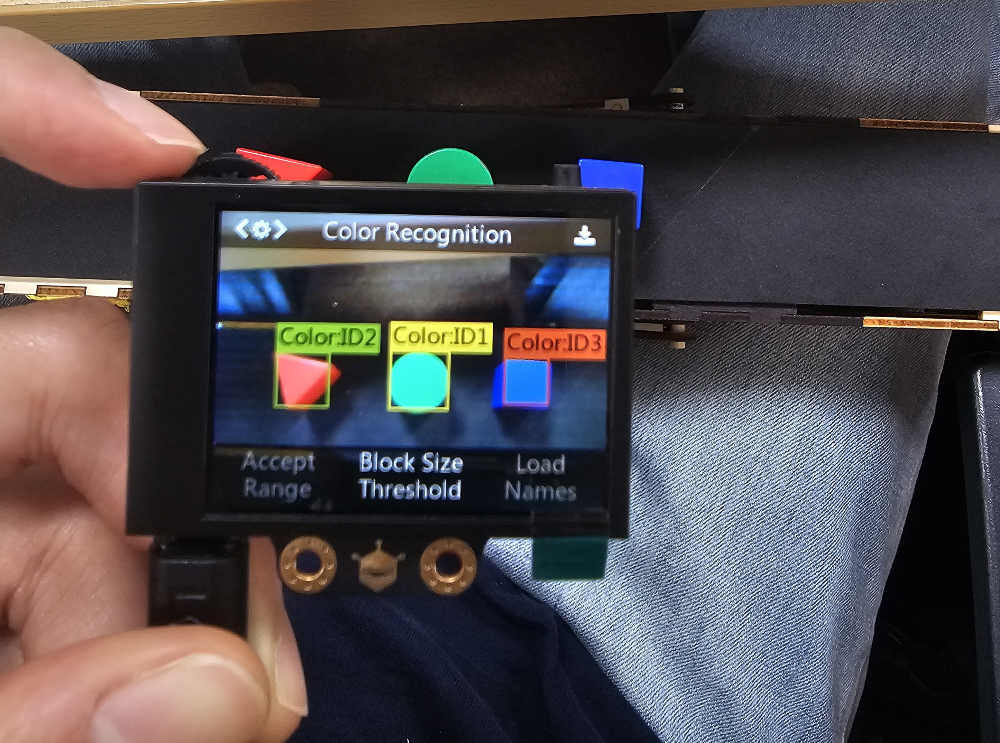

## AGBEE 프로젝트 관련 내용/이슈 정리
- 맡은 역할: HUSKYLENS 를 이용한 물건의 양품/불량품 인식

### 참고문서
- Arduino 라이브러리 함수 설명서:  [HUSKYLENS Arduino API.md](./ref/HUSKYLENS%20Arduino%20API.md)
- 하드웨어 직렬 통신(I2C, UART) 기반의 바이너리 명령어 포맷 설명: [HUSKYLENS Protocol.md](./ref/HUSKYLENS%20Protocol.md)

### 이슈정리
#### 2025.08.01
프로젝트를 하면서 문제가 생겼다.
원래 물체 양품/불량품 분류는 
```
1. QR로 물품 확인
2. 색상으로 양품/불량품 확인
3. 도형으로 양품/불량품 확인
```

이 세 가지 과정을 거친다.

하지만 허스키렌즈에서 모드 전환 시 학습데이터가 유지되는 모드/ 사라지는 모드가 있다고 한다.
확인결과, 얼굴, 사물, 색생, 태그 인식은 데이터가 유지되는 반면 라인 추척, 사물 추적, 사물분류는 모드 전환 시 초기화 된다. 

양품/불량품 판별 과정을 축소화 하던지, 미리 학습시킨 후 시리얼 OR I2C로 직접 프로토콜 제어하며 학습 데이터를 주입하는 방법이 있다. 일단 주어진 시간이 있으니 직접 프로토콜을 제어해보는 방향으로 시도해보려고 한다.

> 두번째 이슈

아두이노와 WIFI D1 R1 보드가 같은 줄 알았다
정확히 말하면 아두이노는 5V 까지의 입/출력이 되는데 현재 사용중인 보드인 **WIFI D1 R1** 같은 경우에는 3.3V 까지 입/출력이 가능하다고 한다. ~~이를 해결하려면 1. 저항 사용, 2. 아두이노 우도 보드로 변경 해야하는데 
보드가 있는지 찾아보고 없으면 저항을 구매해야겠다~~

\+ 저항이 아닌 로직 레벨 컨버터를 이용해야한다

#### 진행상황
**2025.08.01**
- 허스키렌즈 모드 전환 및 로직 구현 완료
  - [detection_husky.ino](./code/detection_husky.ino)
  - 현재 사용중인 보드 입출력 전압문제로 인해 코드 테스트는 못함..
- 양품/ 불량품 기준 선정

#### ~~양품/불량품 기준~~ (08.13 수정)
~~**🔖 Tag ID: 1**~~
- 양품: 파랑 + 원기둥 (가장 기본형, 인식 잘 됨)
- 불량: 빨강 + 삼각기둥 (날카로운 꼭짓점, 구분 확실)

~~**🔖 Tag ID: 2**~~
- 양품: 초록 + 육각기둥 (측면이 많아 형태 명확)
- 불량: 노랑 + 사각뿔 (꼭짓점이 위에 있어 시각적 대비 큼)

~~**🔖 Tag ID: 3**~~
- 양품: 노랑 + 정육면체 (직육면체보다 안정된 정형 도형)
- 불량: 파랑 + 원뿔 (끝이 뾰족해 구분 쉬움)

**양품/불량품 조건 구성 기준**
- 색상은 시각 대비가 확실하게
- 도형은 실루엣이 명확하고 혼동 적은 것 중심
- 같은 색상+도형 조합이 중복되지 않게
- Tag ID마다 양품과 불량이 시각적으로 완전히 구분 가능

**2025.08.04**
- 아두이노 uno를 구매하여 전압 차이로 인한 이슈 해결 (로직 레벨 컨버터 사용안해도됨)
- 코드 컴파일을 통해 모드 전환 잘 되는 것을 확인
- 물품 추가 구매 사항 확인
- 태그 번호 지정

**2025.08.13**
허스키렌즈의 Object Classification 에서 육각기둥, 직육면체, 삼각기둥을 학습 시켰으나 육각기둥과 사각형 구분을 잘 못했다.
사각뿔, 삼각뿔같은 경우에는 로봇팔이 집다가 놓치는 경우가 발생했다.
로봇팔이 잘 집을 수 있는 도형과 카메라가 잘 인식할 수 있는 도형을 선별한 결과 3가지의 도형만을 사용하기로 했다.
- 최종 양품/불량품 기준
  - 도형: 삼각기둥(1), 직육면체(2), 원기둥(3)
  - 색상: 빨, 파, 노, 초

**🔖 Tag ID: 1**
- 태그 이미지
  


- 양품: 파랑 + 원기둥 
- 불량: 빨강 + 삼각기둥

**🔖 Tag ID: 2**
- 태그 이미지
  

- 양품: 초록 + 직육면체
- 불량: 노랑 + 원기둥

**🔖 Tag ID: 3**
- 태그 이미지
  
- 양품: 노랑 + 삼각기둥
- 불량: 파랑 + 직육면체


허스키 렌즈 색상 인식 설정값
- start Range : 20
- Accept Range : 5
- Block Size Threshold : 12

**2025.08.14**
- 색상인식 문제
  - 카메라 자체의 코드를 수정할 수 없었고 카메라 기본 설정값을 통해 색상을 구분할 수 있어야 했다.
  - 상황: 카메라가 이동하는 것이 아닌 컨베이어 벨트 일정한 위치에 카메라가 설치됨
  - 해결방법:
    - 일정한 위치이므로 그 상황에 맞는 설정값을 설정
    - 색상인식에서 변경할 수 있는 값: start Range, Accept Range, Block Size Threshold
    - 각각의 값을 다음과 같이 설정
      - `start Range` : 20
      - `Accept Range` : 5
      - `Block Size Threshold` : 12
    - 테스트 결과: 
      - 이전 보다는 색상 인식이 잘 됨, 주변 작은 영역으로 색상인식되는 경우가 줄어듦
      - 1) 빨간색일때, 초록색일때, 파란색일때 화면에 비치는 색상이 조금씩 다른 경우가 발생
      - 2) 다른 색상이 한꺼번에 화면에 보여질 때 색상 인식이 안되는 이슈
      - 3) 주변 색상 변화로 인해 컨베이어 벨트 색상 변화 일어남 -> 다른 색상으로 인식 하는 경우가 생김
      - 주변 환경의 영향을 많이 받아 컨배이어벨트의 주변 색을 검은색으로 칠하기로 함
      - 테스트 결과:
        - 여러가직 색이 한 꺼번에 인식 되는 경우 해결됨

- 도형 구분 문제
  - 기존 학습을 시켰을 때는 색상과 모양 모두 다르게 한 후에 물체를 학습 시켰다.
  - 육각기둥도 정육면체로 인식하는 문제가 있었다 
  - 해결방법:
    - 같은 색을 사용했고 다른 도형을 사용했다.
    - 빨간색 원기둥, 빨간색 직육면체, 빨간색 삼각기둥
    - 다른 색상을 이용해 테스트 한 결과 도형이 모두 올바르게 인식되는 것을 확인할 수 있었다.

- 학습결과
- 색상ID
  - ID1: 초록
  - ID2: 빨강
  - ID3: 파랑
- 도형ID
  - ID1: 삼각기둥
  - ID2: 원기둥
  - ID3: 직육면체

  

<!-- # 📌 HUSKYLENS 사물 분류 학습 데이터 백업 및 복원 가이드

> 사물 분류 모드에서 학습한 데이터를 유지한 채로 다른 모드 전환을 수행하기 위한 수동 처리 방법

---

## ✅ 개요

HUSKYLENS는 모드 전환 시 학습한 데이터를 유지하지 않습니다.  
따라서 사물 분류 데이터를 백업해 두었다가, 다시 해당 모드로 돌아올 때 수동으로 복원하는 방법이 필요합니다.

---

## 🛠️ 구현 절차

### 1. 사물 분류 모드로 진입
```cpp
huskylens.switchAlgorithm(ALGORITHM_OBJECT_CLASSIFICATION);
```

---

### 2. 학습된 데이터 읽어서 저장
```cpp
huskylens.requestLearned();

while(huskylens.available()) {
    HUSKYLENSResult result = huskylens.read();
    
    // 예시: 필요한 값 저장
    int id = result.ID;
    int x = result.xCenter;
    int y = result.yCenter;
    int width = result.width;
    int height = result.height;

    // 배열이나 구조체에 저장해두기
}
```

---

### 3. 다른 모드로 전환  
다른 알고리즘 모드로 변경 시, 내부 학습 데이터는 초기화됨  
```cpp
huskylens.switchAlgorithm(ALGORITHM_TAG_RECOGNITION); // 예시
```

---

### 4. 사물 분류 모드로 다시 전환
```cpp
huskylens.switchAlgorithm(ALGORITHM_OBJECT_CLASSIFICATION);
```

---

### 5. 백업해둔 데이터 복원 (I2C 프로토콜 사용)
- **0x36: Learn from parameter** 명령 사용
- 전송 포맷:
  ```
  [0x55][0xAA][0x11][0x36][ID_L][ID_H][X_L][X_H][Y_L][Y_H][W_L][W_H][H_L][H_H][Result][Checksum]
  ```

- Arduino에서 I2C 직접 구현 시 예시 (Wire 사용):
```cpp
Wire.beginTransmission(0x32); // HUSKYLENS I2C 주소
Wire.write(0x55);
Wire.write(0xAA);
Wire.write(0x11); // 주소 in protocol
Wire.write(0x36); // Learn by parameter 명령
// 이후 ID, x, y, width, height, learnResult, checksum 전송
Wire.endTransmission();
```

> 🔧 자세한 포맷은 공식 [HUSKYLENS Protocol 문서](https://wiki.dfrobot.com/HUSKYLENS_V1.0_SKU_SEN0305_SEN0336#target_23) 참고

---

## 📝 요약 표

| 단계 | 설명 |
|------|------|
| 1 | `ALGORITHM_OBJECT_CLASSIFICATION`으로 모드 전환 |
| 2 | `requestLearned()` + `read()`로 데이터 추출 |
| 3 | 다른 모드로 전환 |
| 4 | 다시 사물 분류 모드로 전환 |
| 5 | `0x36` 명령으로 백업 데이터 수동 복원 | -->
