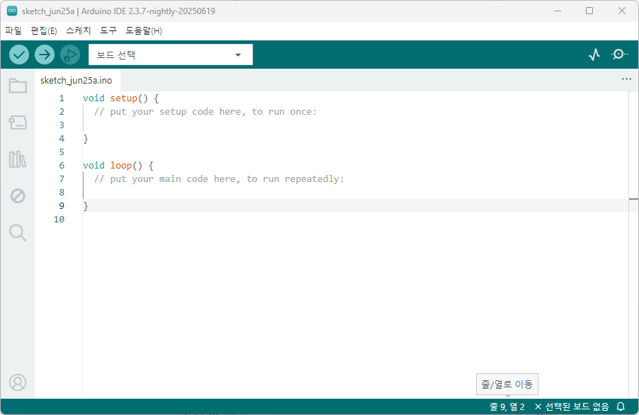
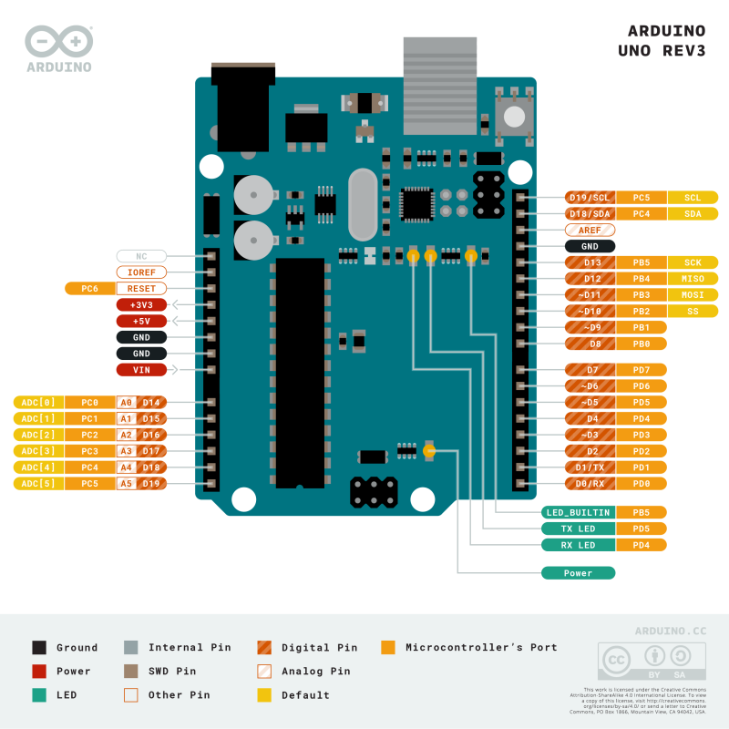
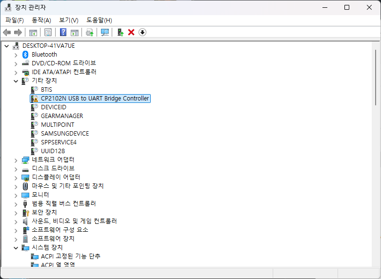
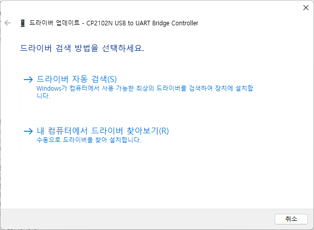
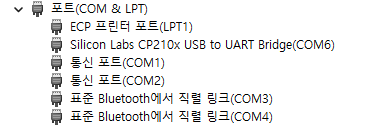

- VCC (5V): 전원 공급
- GND: 접지
- Digital 핀 (D2~D13 등): ON/OFF 감지나 제어 (디지털 입력/출력)
- Analog 핀 (A0~A5): 아날로그 신호 읽기

## 아두이노 공부

### 아두이노(Arduino)란?
- 임베디드 시스템 중 하나
- 2005년 이탈리아의 IDII(Interaction Design Institute Ivera)에서 처음 고안
- 오픈 소스를 기반으로 한 단일 마이크로 컨트롤러로 완성된 보드 관련 개발 도구 및 환경
- 사용법이 간한하기 때문에 임베디드 입문용으로 많이 사용됨

### 아두이노 IDE 프로그램 설치
> [설치링크🔗](https://www.arduino.cc/)
  [아두이노 DOC📜](https://docs.arduino.cc/)



- 아두이노 UNO R3를 이용해 공부를 시작할 예정
### 아두이노 실습 사이트
- [Tinkercad Circuits](https://www.tinkercad.com/)
    - 아두이노 회로와 코드를 가상으로 실습 가능
### 아두이노 UNO Pin Map
- pin map : 보드의 각 핀들에 부여된 기능을 한 눈에 보기 좋게 적어 놓은 지도
- 주요 핀 소개 :
    - `3V3` : 보드로부터 3.3V 전압을 출력할 수 있는 핀
    - `5V` : 보드로부터 5V의 전압을 출력할 수 있는 핀
    - `Vin` : 아두이노에 전원을 공급할 때 사용하는 핀
        - 7 ~ 12V의 전원 제한이 있기 때문에 반드시 해당 전압 범위 내의 전원만 공급해야 한다.
    - `GND` : 보드의 접지 핀
    
    - `A0 ~ A5` : 아날로그 신호를 입, 출력할 수 있는 핀
    
    - `D0 ~ D13` : 디지털 신호를 입, 출력할 수 있는 핀
        - `D0` -> 'Receive 핀'으로, 통신 수행 시 수신 핀으로 사용될 수 있는 핀이다. 
        - `D1` -> 'Transmit 핀'으로, 통신 수행 시 발신 핀으로 사용될 수 있는 핀이다.
        - `D2/D3` -> 인터럽트 기능을 수행할 수 있는 핀이다.
            - 각각 INT0 와 INT1 으로 정의되어 있다.
        
        - `D3/D5/D6/D9/D10/D11` -> PWM 신호를 출력할 수 있는 핀이다.
        보드 상에서는 핀 번호 앞에 `~` 무늬가 붙어 있는 것으로 구별 가능.
- [UNO R3 pinout.pdf](./UNO%20R3-pinout.pdf)



#### 아두이노 종류
1. 아두이노 우노 - 입문용 아두이노
2. 아두이노 나노 
3. 아두이노 마이크로
4. 아두이노 메가 - 
5. 아두이노 듀에 - 가장 성능 좋은 보드


### 허스키렌즈
- AI 비전 센서로 초보자도 쉽게 사용할 수 있도록 설계된 딥러닝 기반의 시각 인식 카메라
- AGV 자동물류 시스템 프로젝트를 위해 구매

#### 주요 기능
| 기능 이름                | 설명                           |
| -------------------- | ---------------------------- |
| **얼굴 인식**            | 사람 얼굴을 인식하고 추적함              |
| **객체 추적**            | 움직이는 물체를 실시간으로 추적함           |
| **물체 인식**            | 학습시킨 물체를 구분하고 인식함            |
| **라인 추적**            | 선(Line)을 따라 움직이는 로봇 등에 사용 가능 |
| **QR코드 인식**          | QR코드를 인식하고 해석함               |
| **색상 인식**            | 지정한 색상을 인식하고 추적함             |
| **태그 인식 (AprilTag)** | 태그를 인식하여 위치나 ID 확인에 사용됨      |
#### 사용방법
**라이브러리 설치**
- 링크: https://wiki.dfrobot.com/HUSKYLENS_V1.0_SKU_SEN0305_SEN0336#target_23
- 링크 클릭 후 **4.1 In Windows 항목**에서 설치방법을 자세하게 확인 가능


1. CP210x_Universal_Windows_Driver.zip 압축 풀기
2. ⚠️ 떠 있는 항목 오른쪽 클릭 > 드라이버 업데이트 > 내 컴퓨터에서 드라이버 찾아보기 > 


3. 압축 푼 폴더 경로 (예: `C:\Users\...\CP210x_Universal_Windows_Driver`) 선택
4. `다음` 버튼 누르면 자동으로 `.inf` 파일 읽고 드라이버 설치
5. **Silicon Labs CP210x USB to UART Bridge(COMX)** 나오면 설치 완료




### 아두이노 WIFI D1 R1
- ESP8266 칩셋 기반의 WiFi 기능이 내장된 아두이노 호환 보드

#### 핀 배치
- D1 R1 보드는 ESP8266 기반으로 아두이노 UNO와 핀 배치가 다르다
- D0을 제외한 나머지 핀은 PWM 값 출력 가능하다 (UNO는 정해져있음)
- D0은 Deep Sleep 용도

#### ESP8266 보드 설치 단계
1. 보드 매니저 URL 추가
파일 > 기본 설정 > 추가 보드 관리자 URL에 다음 주소 입력 (단축키 Ctrl + ,)
```
https://arduino.esp8266.com/stable/package_esp8266com_index.json
```

2. 보드 매니저에서 ESP8266 설치
- 도구 > 보드 > 보드 매니저 > ESP8266 입력
- `ESP8266 by ESP8266 Community` 설치
보드 매니저 ESP8266 검색후 

#### 아두이노 코드 구조
```c
void setup() {
  // 이 부분은 딱 한 번만 실행 (초기 설정)
  pinMode(LED_BUILTIN, OUTPUT);  // 핀을 출력으로 설정
}

void loop() {
  // 이 부분은 계속 반복 실행
  digitalWrite(LED_BUILTIN, HIGH); // LED 켜기
  delay(1000);                     // 1초 대기
  digitalWrite(LED_BUILTIN, LOW);  // LED 끄기
  delay(1000);                     // 1초 대기
}
```
#### 자주 사용하는 함수
- `digitalWrite(pin, HIGH/LOW)` - 디지털 출력
- `digitalRead(pin)` - 디지털 입력
- `analogWrite(pin, 0~255)` - 아날로그 출력
- `analogRead(pin)` - 아날로그 입력
- `pinMode(pin, INPUT/OUTPUT)` - 핀 설정
- `delay(ms)` - 지연 시간 1000 → 1초

### 아두이노 학습자료
- [1] 공식 튜토리얼
    - https://docs.arduino.cc/built-in-examples/
- [2] 추후 추가..

### 아날로그/ 디지털
- 디지털
    - 0 과 1 , LOW와 HIGH 두 가지 상태
- 아날로그 
    - 연속적인 값


#### Q. 아날로그의 입력 범위(0 ~ 1023) 와 아날로그 출력 값 범위 (0 ~ 255)는 다를까?
아날로그 입력 함수인 `analogRead()` 는 진짜 전압을 읽는다. 아두이노 보드의 아날로그 입력 핀은 내부에 ADC (Analog to Digital Converter)가 있어 0 ~ 5V까지의 전압을 디지털 숫자로 변환해준다.

UNO 기준 10비트 ADC
- 10비트 = 2¹⁰ = 1024개의 단계
- 즉, `analogRead()`는 항상 0 ~ 1023 범위의 값을 반환

| 입력 전압 | `analogRead()` 결과 |
| ----- | ----------------- |
| 0V    | 0                 |
| 2.5V  | 약 512             |
| 5V    | 1023              |

반면, 아날로그 출력 함수인 `analogWrite()` 는 진짜 아날로그 전압을 출력하지 않는다.
PWM(Pulse Width Modulation)로 가짜 아날로그처럼 보이게 만들어 준다.

**🧠 PWM은 어떻게 동작하나?**
- 핀을 아주 빠르게 ON/OFF 반복함
- ON 비율이 많으면 전압이 높게 느껴짐, OFF 비율이 많으면 낮게 느껴짐
- 이 ON/OFF 비율을 8비트로 표현 → 2⁸ = 256단계 → 0~255

| `analogWrite()` 값 | PWM Duty (%) | 느낌상 출력 전압   |
| ----------------- | ------------ | ----------- |
| 0                 | 0%           | 0V (항상 OFF) |
| 127               | 약 50%        | 약 2.5V 느낌   |
| 255               | 100%         | 5V (항상 ON)  |


### 아두이노 통신방법
- UART (시리얼 통신)
- I2C
- SPI

### 통신에서의 동기/비동기
통신할 때 타이밍을 맞추는 방식

**1. 동기식(Synchronous)**
- 공통의 클럭(Clock) 신호를 기반으로 송수신 타이밍을 양쪽이 동시에 맞춤
- **Master(주장치)**가 클럭을 제공하고 **Slave(종속장치)**가 그에 맞춰 동작
- 데이터와 클럭 신호를 함께 보냄
- 통신하는 주체가 서로 타이밍을 정확하게 맞춰야함

- 장점
    - 빠르고 정확함
    - 데이터 흐름을 예측 가능
- 단점
    - 클럭 선이 추가로 필요 (배선 많아짐)
    - 다소 하드웨어 복잡함
- 예시
    - I2C
    - SPI

**2. 비동기식(Asynchronous)**
- 클럭 신호 없이 데이터만 송수신
- 대신 데이터 앞뒤에 스타트 비트 / 스톱 비트를 붙여서 시작·종료를 알려줌
- 송수신 장치가 미리 속도(baud rate) 를 정해서 맞춰야 함
- 일정한 속도에 맞춰 통신하는 방식
- 장점
    - 선이 적음 (TX, RX만 있으면 됨)
    - 단순한 구조

- 단점
    - 속도 빠르게 설정하면 오류 가능성 증가
    - 스타트/스톱/패리티 비트 등으로 데이터 효율↓

- 예시
    - UART (Serial 통신)
    - Bluetooth 통신 대부분

> 소프트웨어에서의 동기/비동기랑은 다른 개념이다!

AGBEE 관련 내용 정리 [👉 Click](./HUSKYLENS/HUSKY.md) 

### 아두이노 Serial 로그 출력
아두이노 예제 코드를 분석하던 중 Serial.println(String() + F("내용")); 형식의 출력문을 자주 발견했다.
C/C++의 일반적인 출력 방식과는 차이가 있기 때문에, 이 구문이 사용되는 이유를 정리해보았다.
**F() 를 사용하는 이유?**
- 일반적으로 문자열은 **RAM 영역**에 저장된다.
- `F("문자열")` 은 문자열을 **RAM 이 아닌 플래시 메모리(프로그램 메모리)**에 저장한다.
- 아두이노 같은 메모리가 제한된 보드에서 RAM을 절약하기 위해 `F()` 매크로를 사용된다.

String() 은?
- C++ 에서 `F("")` 는 `__FlashStringHelper*` 타입.
- `String` 과 바로 `+` 이 되지 않기 때문에 `String()`을 통해 빈 문자열을 생성하여 `+` 연산을 가능하게 만든다.